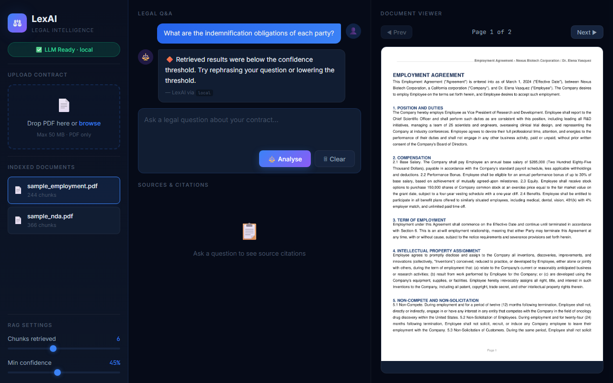
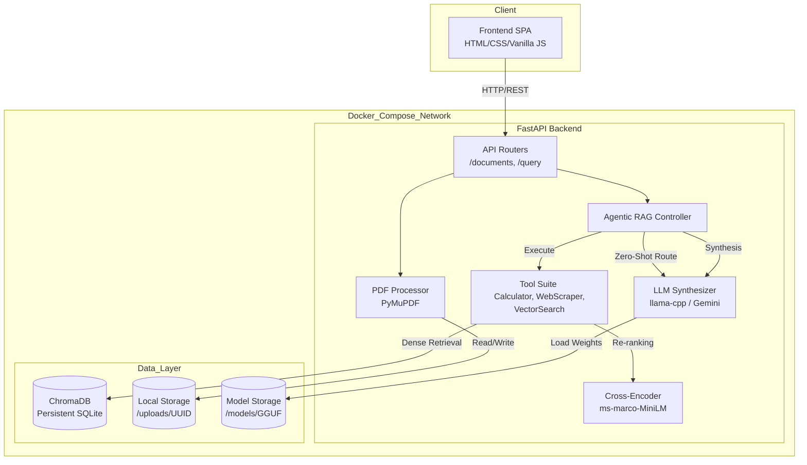

# LexAI: Agentic Knowledge Assistant

LexAI is an advanced **Agentic RAG System** designed for absolute data privacy and dynamic reasoning. Moving beyond standard RAG, LexAI features an autonomous local agent (powered by a quantized Gemma 2 2B via llama-cpp) that evaluates and routes user queries on the fly. 

Whether it needs to evaluate mathematical expressions, scrape live web data for current events, or perform a two-stage semantic vector search across internal legal contracts (using ChromaDB, BGE embeddings, and MS-MARCO Cross-Encoder re-ranking), the system chooses the right tool dynamically and operates **100% locally with zero data leakage**.

## 🔥 Extraordinary Agentic Features

What separates LexAI from a standard RAG pipeline?

- **Dynamic Tool Routing:** Instead of blindly querying a vector database for every prompt, LexAI acts as an intelligent router. It reads the query and autonomously delegates it to one of three specialized tools:
  - 🧮 **Python Calculator (`numexpr`)**: Evaluates complex math equations safely.
  - 🌐 **Live Web Scraper (`duckduckgo-search`)**: Fetches real-time news and events from the web.
  - 📚 **Vector Search Pipeline**: Queries the local ChromaDB for contract analysis.
- **Zero-Data Leakage Architecture:** Both the routing logic and the answer synthesis are handled by a local `llama-cpp` quantized model. No cloud dependencies are required.
- **Two-Stage RAG Fallback:** When querying internal documents, it uses high-recall dense retrieval (Bi-Encoder) followed by high-precision re-ranking (Cross-Encoder) to ensure the LLM receives the absolute best context.

## Demo



## Architecture

### High-Level System Architecture



### Agentic Query Pipeline

```mermaid
sequenceDiagram
    participant User
    participant Agent as Agentic Controller
    participant LLM as Synthesizer (Llama.cpp)
    participant Tools as Tool Suite (Calc, Web, DB)

    User->>Agent: POST /query (Question)
    
    rect rgb(40, 20, 60)
    Note over Agent,LLM: STAGE 1: Routing
    Agent->>LLM: generate_raw(Router Prompt + Question)
    activate LLM
    LLM-->>Agent: JSON Tool Decision (e.g., {"tool": "web_scraper", "input": "NASA news"})
    deactivate LLM
    end

    rect rgb(60, 40, 20)
    Note over Agent,Tools: STAGE 2: Execution
    Agent->>Tools: tool.run(input)
    activate Tools
    Tools-->>Agent: Tool Output / Context
    deactivate Tools
    end

    rect rgb(20, 60, 40)
    Note over Agent,LLM: STAGE 3: Generation
    Agent->>LLM: generate(Knowledge Assistant Prompt + Context + Question)
    activate LLM
    LLM-->>Agent: Synthesized Answer
    deactivate LLM
    end

    Agent-->>User: QueryResponse (Answer)
```



## Quick Start

```bash
# Install dependencies
pip install -r requirements.txt
pip install llama-cpp-python --extra-index-url https://abetlen.github.io/llama-cpp-python/whl/cpu

# Configure
cp .env.example .env

# Download base model (~1.6 GB)
python download_model.py

# Generate sample legal PDFs
python data/create_sample_pdfs.py

# Start
python -m uvicorn backend.main:app --host 0.0.0.0 --port 8000
```

Open http://localhost:8000 for the UI, or http://localhost:8000/docs for the API.

## Docker

```bash
docker compose up --build
```

Models, ChromaDB, and uploads are persisted via volume mounts.

## Project Structure

```
backend/
  main.py                 # FastAPI entrypoint, lifespan model loading
  config.py               # Pydantic settings from .env
  models/
    agent.py               # Agentic RAG Controller (Routing & Execution)
    tools.py               # Calculator, WebScraper, and VectorSearch tools
    vector_store.py        # ChromaDB wrapper, BGE embeddings
    synthesizer.py         # llama-cpp / Gemini LLM abstraction
  routers/
    documents.py           # Upload, list, delete, PDF rendering
    query.py               # Agentic RAG query and semantic search endpoints
  utils/
    pdf_processor.py       # PyMuPDF text extraction with bounding boxes
    citation_builder.py    # Logit-to-probability, confidence tiers
frontend/
  index.html              # Single-page app
  app.js                  # State management, API calls, PDF viewer
  style.css               # Dark-mode UI
fine_tuning/
  prepare_dataset.py      # CUAD dataset -> Gemma instruction format
  train.py                # QLoRA fine-tuning (SFTTrainer)
  export_gguf.py          # Merge adapters + GGUF conversion
data/
  create_sample_pdfs.py   # Generates demo legal contracts
```

## Fine-Tuning

Requires a GPU (Colab T4 works):

```bash
pip install torch transformers peft trl bitsandbytes accelerate datasets
python fine_tuning/prepare_dataset.py --output data/legal_finetune.jsonl
python fine_tuning/train.py --dataset data/legal_finetune.jsonl --epochs 3
python fine_tuning/export_gguf.py --adapter_dir adapters/legal_gemma2
```

Place the exported GGUF in `models/` and update `MODEL_PATH` in `.env`.

## Configuration

| Variable | Default | Description |
|---|---|---|
| `MODEL_PATH` | `./models/gemma-2-2b-it-Q4_K_M.gguf` | Path to GGUF model |
| `LLM_BACKEND` | `local` | `local` or `gemini` |
| `MODEL_THREADS` | `8` | CPU threads for inference |
| `EMBEDDING_MODEL` | `BAAI/bge-small-en-v1.5` | Sentence embedding model |
| `TOP_K_RETRIEVAL` | `6` | Chunks retrieved per query |
| `CONFIDENCE_THRESHOLD` | `0.45` | Minimum confidence to show |

## Load Testing

```bash
python load_test.py --concurrency 50 --requests 100
```

Measured on an i5 12th Gen / 16 GB RAM:

| Endpoint | P50 | P95 | Uptime |
|---|---|---|---|
| Vector Search | 360ms | 466ms | 100% |
| Full RAG | 3,021ms | 21,266ms | 100% |

## Tech Stack

| Component | Technology |
|---|---|
| Embeddings | BAAI/bge-small-en-v1.5 |
| Vector DB | ChromaDB (persistent, cosine) |
| Re-ranking | cross-encoder/ms-marco-MiniLM-L-6-v2 |
| LLM | llama-cpp-python (Gemma 2 2B Q4_K_M) |
| Web Scraper | duckduckgo-search |
| Safe Math | numexpr |
| Backend | FastAPI + Uvicorn |
| Frontend | Vanilla JS |
| Fine-tuning | PyTorch + PEFT/QLoRA + TRL |
