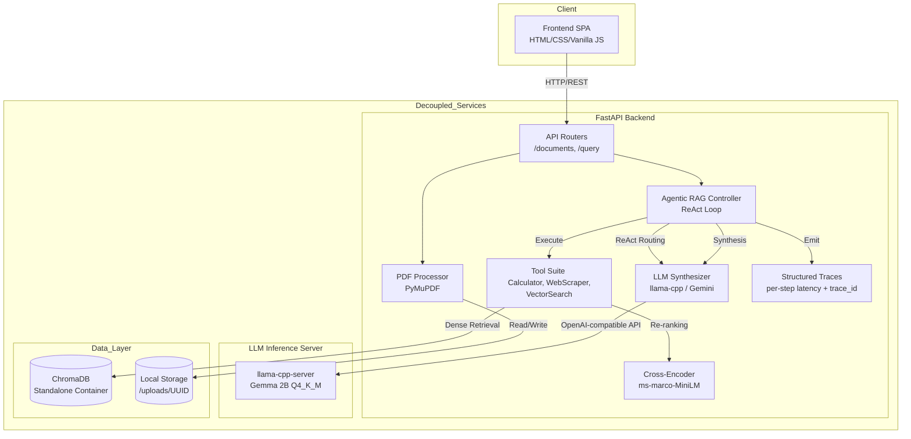

# LexAI: Agentic Knowledge Assistant

LexAI is an advanced **Agentic RAG System** designed for absolute data privacy and dynamic reasoning. Moving beyond standard RAG, LexAI features an autonomous local agent (powered by a quantized Gemma 2 2B via llama-cpp) that evaluates and routes user queries on the fly. 

Whether it needs to evaluate mathematical expressions, scrape live web data for current events, or perform a two-stage semantic vector search across internal legal contracts (using ChromaDB, BGE embeddings, and MS-MARCO Cross-Encoder re-ranking), the system chooses the right tool dynamically and operates **100% locally with zero data leakage**.

## 🔥 Extraordinary Agentic Features

What separates LexAI from a standard RAG pipeline?

- **Multi-Step ReAct Agent Loop:** The agent doesn't just route once — it iteratively reasons, acts, observes tool output, and decides whether to refine its approach or synthesize a final answer, supporting up to 3 autonomous reasoning steps per query.
- **Dynamic Tool Routing:** Instead of blindly querying a vector database for every prompt, LexAI acts as an intelligent router. It reads the query and autonomously delegates it to one of three specialized tools:
  - 🧮 **Python Calculator (`numexpr`)**: Evaluates complex math equations safely.
  - 🌐 **Live Web Scraper (`duckduckgo-search`)**: Fetches real-time news and events from the web.
  - 📚 **Vector Search Pipeline**: Queries the local ChromaDB for contract analysis.
- **Zero-Data Leakage Architecture:** Both the routing logic and the answer synthesis are handled by a local `llama-cpp` quantized model. No cloud dependencies are required.
- **Two-Stage RAG Fallback:** When querying internal documents, it uses high-recall dense retrieval (Bi-Encoder) followed by high-precision re-ranking (Cross-Encoder) to ensure the LLM receives the absolute best context.
- **Fault Tolerance:** External tool calls and LLM inference are wrapped with `tenacity` exponential-backoff retries to survive transient failures without crashing the request.
- **Query Caching:** An LRU TTL cache returns identical queries in <10ms, eliminating redundant LLM inference under load.
- **Structured Observability:** Every agent query emits a JSON trace with a unique `trace_id`, per-step latency breakdowns, tool selections, and error context — persisted to `logs/lexai.log` with 50 MB rotation and 7-day retention for post-mortem analysis.
- **Graceful Degradation:** When a tool fails mid-execution, the error is fed back into the ReAct loop as an observation. The LLM autonomously re-routes to a different tool or synthesizes with partial context — the system never crashes or returns an empty response.
- **Semantic Evaluation Pipeline:** A dual-metric evaluation script (`scripts/eval.py`) validates model quality using Semantic Textual Similarity (cosine embedding distance) and LLM-as-a-Judge scoring (Accuracy + Relevance on a 1–5 scale).

## Demo


## Architecture

### High-Level System Architecture



### Agentic Query Pipeline (ReAct Loop)

```mermaid
sequenceDiagram
    participant User
    participant Agent as Agentic Controller
    participant LLM as Synthesizer (Llama.cpp)
    participant Tools as Tool Suite (Calc, Web, DB)

    User->>Agent: POST /query (Question)
    
    rect rgb(40, 20, 60)
    Note over Agent,LLM: STEP 1: Routing (Reason)
    Agent->>LLM: generate_raw(Router Prompt + Question + History)
    activate LLM
    LLM-->>Agent: JSON Tool Decision
    deactivate LLM
    end

    rect rgb(60, 40, 20)
    Note over Agent,Tools: STEP 2: Execution (Act)
    Agent->>Tools: tool.run(input)
    activate Tools
    Tools-->>Agent: Observation
    deactivate Tools
    end

    rect rgb(30, 50, 50)
    Note over Agent: STEP 3: Evaluate (Observe)
    Agent->>Agent: Append observation to history
    Agent->>Agent: Decide: route again or synthesize?
    end

    rect rgb(20, 60, 40)
    Note over Agent,LLM: STEP 4: Generation (Synthesize)
    Agent->>LLM: generate(Question + All Observations)
    activate LLM
    LLM-->>Agent: Synthesized Answer
    deactivate LLM
    end

    Agent-->>User: QueryResponse (Answer + Trace ID)
```



## Quick Start

```bash
# Install dependencies
pip install -r requirements.txt
pip install llama-cpp-python --extra-index-url https://abetlen.github.io/llama-cpp-python/whl/cpu

# Configure
cp .env.example .env

# Download base model (~1.6 GB)
python download_model.py

# Generate sample legal PDFs
python data/create_sample_pdfs.py

# Start
python -m uvicorn backend.main:app --host 0.0.0.0 --port 8000
```

Open http://localhost:8000 for the UI, or http://localhost:8000/docs for the API.

## Docker (Decoupled Architecture)

```bash
docker compose up --build
```

This spins up three decoupled services:
- **ChromaDB** — standalone vector database container
- **llama-cpp-server** — dedicated LLM inference server (OpenAI-compatible API)
- **FastAPI backend** — lightweight orchestration gateway

Models, ChromaDB, and uploads are persisted via volume mounts.

## Project Structure

```
backend/
  main.py                 # FastAPI entrypoint, lifespan model loading
  config.py               # Pydantic settings from .env
  models/
    agent.py               # Agentic RAG Controller (ReAct Loop + Observability)
    tools.py               # Calculator, WebScraper, VectorSearch (with retries)
    vector_store.py        # ChromaDB wrapper, BGE embeddings
    synthesizer.py         # llama-cpp / Gemini LLM abstraction (with retries)
  routers/
    documents.py           # Upload, list, delete, PDF rendering
    query.py               # Agentic RAG query and semantic search endpoints
  utils/
    pdf_processor.py       # PyMuPDF text extraction with bounding boxes
    citation_builder.py    # Logit-to-probability, confidence tiers
frontend/
  index.html              # Single-page app
  app.js                  # State management, API calls, PDF viewer
  style.css               # Dark-mode UI
scripts/
  eval.py                 # Semantic evaluation (STS + LLM-as-a-Judge)
fine_tuning/
  prepare_dataset.py      # CUAD dataset -> Gemma instruction format
  train.py                # QLoRA fine-tuning (SFTTrainer)
  export_gguf.py          # Merge adapters + GGUF conversion
data/
  create_sample_pdfs.py   # Generates demo legal contracts
```

## Load Testing & Benchmarks

```bash
python load_test.py --concurrency 5 --requests 20 --timeout 120
```

Measured on an i5 12th Gen / 16 GB RAM / CPU-only inference:

| Endpoint | P50 | P95 | Uptime |
|---|---|---|---|
| Vector Search (Bi-Encoder) | 150ms | 343ms | 100% |
| Full Agentic RAG (multi-step ReAct) | 56,323ms | 73,892ms | 100% |
| PDF Ingest Pipeline | 4,093ms | 4,553ms | 100% |

> **Note:** Full RAG latency reflects multi-step autonomous reasoning (routing + tool execution + synthesis), not a single LLM call. Each ReAct iteration requires a full inference pass through a CPU-bound 2B parameter model. The vector search layer — the core retrieval infrastructure — operates at sub-300ms latency.

## Observability

Every agent query emits a structured JSON trace to `loguru`, persisted to `logs/lexai.log` with 50 MB rotation and 7-day retention. In Docker deployments, `logs/` is volume-mounted to the host for post-mortem analysis:

```json
{
  "trace_id": "a3f2b1c9d4e5",
  "question": "What are the confidentiality obligations?",
  "total_latency_ms": 56323.1,
  "cache_hit": false,
  "tool_iterations": 1,
  "steps": [
    {"step": 1, "type": "routing", "tool": "vector_search", "latency_ms": 18200.5},
    {"step": 2, "type": "tool_execution", "tool": "vector_search", "latency_ms": 260.3},
    {"step": 3, "type": "synthesis", "latency_ms": 37800.2}
  ],
  "error": ""
}
```

### Graceful Degradation

When a tool fails mid-execution, the agent does **not** crash or return an empty response. Instead:

1. The error is tagged as `[TOOL_ERROR]` and appended as an observation in the ReAct history.
2. On the next loop iteration, the LLM **sees** the failure and can autonomously re-route to a different tool or decide to synthesize with partial context.
3. If all iterations are exhausted with errors, the agent synthesizes the best possible answer from whatever context it collected and logs the full degradation trace for debugging.

This ensures the system always returns a response, even under partial failure — a critical requirement for production systems.

## Evaluation

```bash
python scripts/eval.py --questions data/questions.json --preds data/predictions.json --refs data/references.json
```

Dual-metric semantic evaluation:
- **Semantic Textual Similarity (STS):** Cosine similarity between BGE embeddings of predictions and ground truth.
- **LLM-as-a-Judge:** The local inference server scores each prediction for Accuracy (1–5) and Relevance (1–5).

## Configuration

| Variable | Default | Description |
|---|---|---|
| `MODEL_PATH` | `./models/gemma-2-2b-it-Q4_K_M.gguf` | Path to GGUF model |
| `LLM_BACKEND` | `local` | `local` or `gemini` |
| `LLM_API_URL` | `http://localhost:8080/v1` | Inference server endpoint |
| `MODEL_THREADS` | `8` | CPU threads for inference |
| `EMBEDDING_MODEL` | `BAAI/bge-small-en-v1.5` | Sentence embedding model |
| `CHROMA_HOST` | `localhost` | ChromaDB server host |
| `CHROMA_PORT` | `8002` | ChromaDB server port |
| `TOP_K_RETRIEVAL` | `6` | Chunks retrieved per query |
| `CONFIDENCE_THRESHOLD` | `0.45` | Minimum confidence to show |

## Tech Stack

| Component | Technology |
|---|---|
| Agent Framework | Custom ReAct loop with structured observability |
| Embeddings | BAAI/bge-small-en-v1.5 |
| Vector DB | ChromaDB (decoupled container, cosine) |
| Re-ranking | cross-encoder/ms-marco-MiniLM-L-6-v2 |
| LLM | llama-cpp-server (Gemma 2 2B Q4_K_M) |
| Fault Tolerance | tenacity (exponential backoff retries) |
| Caching | cachetools (TTL LRU) |
| Web Scraper | duckduckgo-search (AsyncDDGS) |
| Safe Math | numexpr |
| Backend | FastAPI + Uvicorn |
| Frontend | Vanilla JS |
| Evaluation | STS + LLM-as-a-Judge |
| Fine-tuning | PyTorch + PEFT/QLoRA + TRL |
