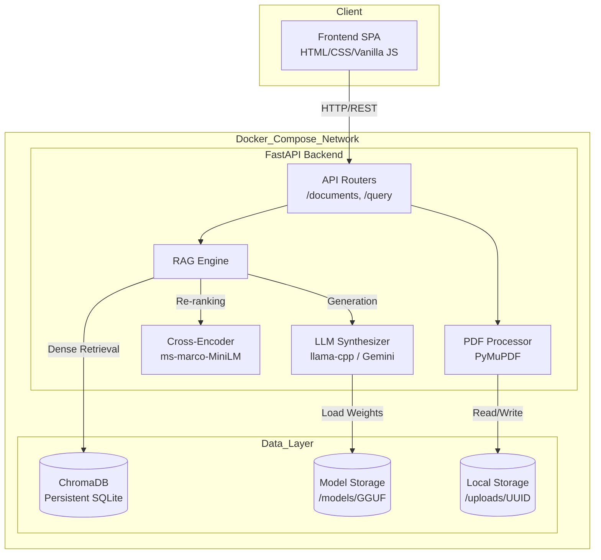

# LexAI

Two-stage RAG system for legal contract analysis. Queries legal PDFs using a bi-encoder for dense retrieval (ChromaDB + BGE), a cross-encoder for re-ranking (ms-marco-MiniLM), and a local quantized LLM (Gemma 2 2B via llama-cpp) for answer synthesis with exact page citations.

## Demo


## Architecture

### High-Level System Architecture



### Two-Stage RAG Query Pipeline

```mermaid
sequenceDiagram
    participant User
    participant RAGEngine as RAG Engine
    participant VectorDB as Bi-Encoder (Chroma)
    participant CrossEncoder as Cross-Encoder
    participant LLM as Synthesizer (Llama.cpp)

    User->>RAGEngine: POST /query (Question)
    
    rect rgb(20, 40, 60)
    Note over RAGEngine,VectorDB: STAGE 1: Dense Retrieval
    RAGEngine->>VectorDB: query(top_k=20)
    activate VectorDB
    VectorDB-->>RAGEngine: Top 20 candidate chunks
    deactivate VectorDB
    end

    rect rgb(60, 40, 20)
    Note over RAGEngine,CrossEncoder: STAGE 2: Re-ranking
    RAGEngine->>CrossEncoder: predict(pairs=[[Q, Chunk1], ...])
    activate CrossEncoder
    CrossEncoder-->>RAGEngine: Raw Logits [2.5, -1.2, 4.1...]
    deactivate CrossEncoder
    RAGEngine->>RAGEngine: Sort descending, slice Top 6
    RAGEngine->>RAGEngine: Convert Logits to Sigmoid Probabilities
    end

    rect rgb(20, 60, 40)
    Note over RAGEngine,LLM: STAGE 3: Generation
    RAGEngine->>LLM: generate(Prompt + Top 6 Context)
    activate LLM
    LLM-->>RAGEngine: Synthesized Answer + Citations
    deactivate LLM
    end

    RAGEngine-->>User: QueryResponse (Answer + Citations)
```



## Quick Start

```bash
# Install dependencies
pip install -r requirements.txt
pip install llama-cpp-python --extra-index-url https://abetlen.github.io/llama-cpp-python/whl/cpu

# Configure
cp .env.example .env

# Download base model (~1.6 GB)
python download_model.py

# Generate sample legal PDFs
python data/create_sample_pdfs.py

# Start
python -m uvicorn backend.main:app --host 0.0.0.0 --port 8000
```

Open http://localhost:8000 for the UI, or http://localhost:8000/docs for the API.

## Docker

```bash
docker compose up --build
```

Models, ChromaDB, and uploads are persisted via volume mounts.

## Project Structure

```
backend/
  main.py                 # FastAPI entrypoint, lifespan model loading
  config.py               # Pydantic settings from .env
  models/
    rag_engine.py          # Two-stage retrieve -> re-rank -> generate
    vector_store.py        # ChromaDB wrapper, BGE embeddings
    synthesizer.py         # llama-cpp / Gemini LLM abstraction
  routers/
    documents.py           # Upload, list, delete, PDF rendering
    query.py               # RAG query and semantic search endpoints
  utils/
    pdf_processor.py       # PyMuPDF text extraction with bounding boxes
    citation_builder.py    # Logit-to-probability, confidence tiers
frontend/
  index.html              # Single-page app
  app.js                  # State management, API calls, PDF viewer
  style.css               # Dark-mode UI
fine_tuning/
  prepare_dataset.py      # CUAD dataset -> Gemma instruction format
  train.py                # QLoRA fine-tuning (SFTTrainer)
  export_gguf.py          # Merge adapters + GGUF conversion
data/
  create_sample_pdfs.py   # Generates demo legal contracts
```

## Fine-Tuning

Requires a GPU (Colab T4 works):

```bash
pip install torch transformers peft trl bitsandbytes accelerate datasets
python fine_tuning/prepare_dataset.py --output data/legal_finetune.jsonl
python fine_tuning/train.py --dataset data/legal_finetune.jsonl --epochs 3
python fine_tuning/export_gguf.py --adapter_dir adapters/legal_gemma2
```

Place the exported GGUF in `models/` and update `MODEL_PATH` in `.env`.

## Configuration

| Variable | Default | Description |
|---|---|---|
| `MODEL_PATH` | `./models/gemma-2-2b-it-Q4_K_M.gguf` | Path to GGUF model |
| `LLM_BACKEND` | `local` | `local` or `gemini` |
| `MODEL_THREADS` | `8` | CPU threads for inference |
| `EMBEDDING_MODEL` | `BAAI/bge-small-en-v1.5` | Sentence embedding model |
| `TOP_K_RETRIEVAL` | `6` | Chunks retrieved per query |
| `CONFIDENCE_THRESHOLD` | `0.45` | Minimum confidence to show |

## Load Testing

```bash
python load_test.py --concurrency 50 --requests 100
```

Measured on an i5 12th Gen / 16 GB RAM:

| Endpoint | P50 | P95 | Uptime |
|---|---|---|---|
| Vector Search | 360ms | 466ms | 100% |
| Full RAG | 3,021ms | 21,266ms | 100% |

## Tech Stack

| Component | Technology |
|---|---|
| Embeddings | BAAI/bge-small-en-v1.5 |
| Vector DB | ChromaDB (persistent, cosine) |
| Re-ranking | cross-encoder/ms-marco-MiniLM-L-6-v2 |
| LLM | llama-cpp-python (Gemma 2 2B Q4_K_M) |
| PDF | PyMuPDF |
| Backend | FastAPI + Uvicorn |
| Frontend | Vanilla JS |
| Fine-tuning | PyTorch + PEFT/QLoRA + TRL |
