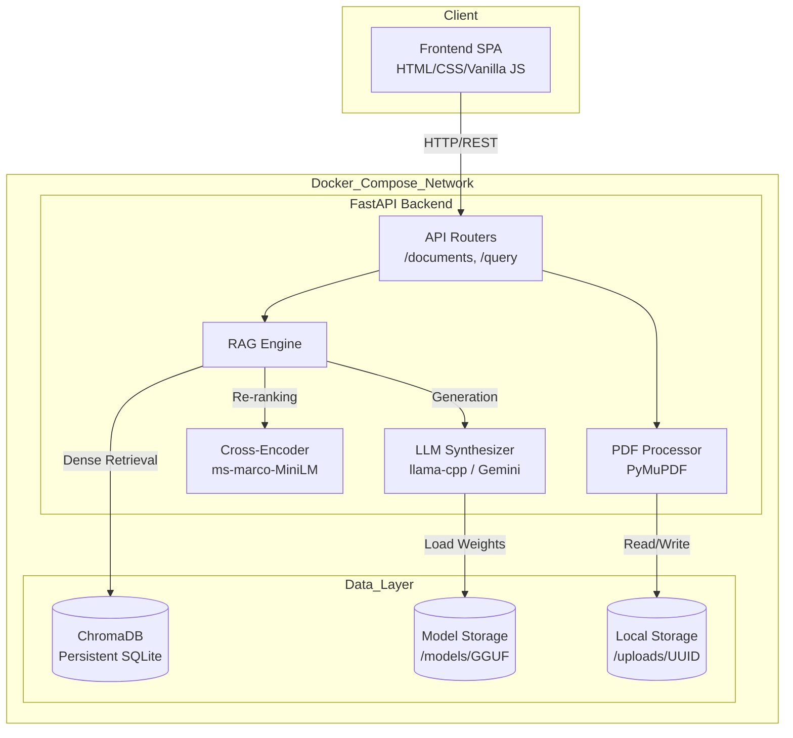
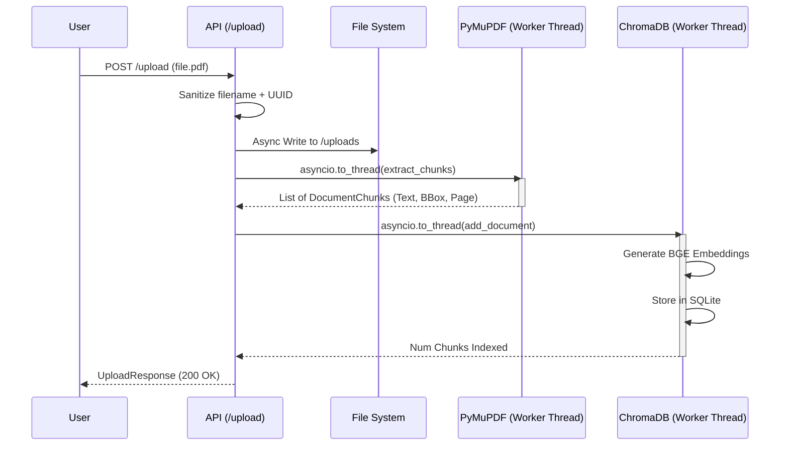
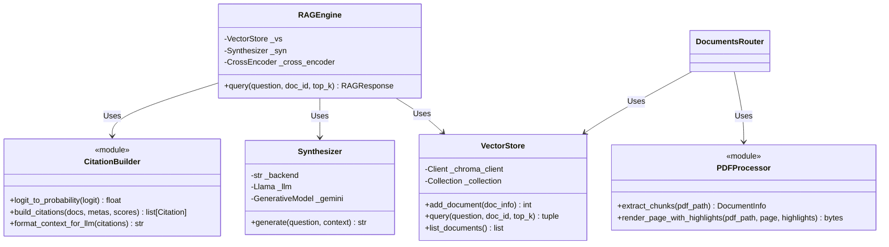

# System Design & Architecture: LexAI

This document provides a comprehensive technical breakdown of the hardened LexAI legal document intelligence platform.

---

## 1. High-Level System Architecture

LexAI uses a modern, containerized, asynchronous micro-monolith architecture. The entire system is packaged via Docker Compose, bridging a high-performance Vanilla JS frontend with a Python-based asynchronous ML backend.

---

## 2. Component Design & Responsibilities

### Frontend (Client-Side)
- **`app.js`**: Handles state management locally. Manages the DOM, chat rendering, PDF viewport loading, and async `fetch` calls to the FastAPI backend.
- **`style.css`**: Provides the premium dark-mode, neomorphic glass UI.

### Backend (Server-Side)
- **`main.py`**: The ASGI entry point. Manages the application `lifespan` context, instantiating the heavy ML models (`VectorStore`, `Synthesizer`, `RAGEngine`, `CrossEncoder`) once at startup into memory.
- **`routers/documents.py`**: Manages secure file uploads (UUID sanitization) and triggers async `PyMuPDF` text chunking and DB indexing. Also renders highlight-annotated PDF pages as PNGs.
- **`routers/query.py`**: The main entry point for user chat. Validates input schemas and triggers the `RAGEngine`.
- **`models/rag_engine.py`**: Orchestrates the **Two-Stage Retrieval Pipeline**.
- **`models/vector_store.py`**: Wraps `ChromaDB` and uses `BAAI/bge-small-en-v1.5` for creating dense vector embeddings of document chunks.
- **`models/synthesizer.py`**: Wraps `llama-cpp-python` for local CPU inference of GGUF models.

---

## 3. Data Flow: Document Ingestion Pipeline

When a user uploads a PDF, the system executes an asynchronous ingestion pipeline, ensuring the main server thread is never blocked.

---

## 4. Data Flow: Two-Stage RAG Query Pipeline

This represents the core technical achievement of the system. It uses a **Bi-Encoder** for fast semantic search (high recall) and a **Cross-Encoder** for precise relevance scoring (high precision).

```mermaid
sequenceDiagram
    participant User
    participant RAGEngine as RAG Engine
    participant VectorDB as Bi-Encoder (Chroma)
    participant CrossEncoder as Cross-Encoder
    participant LLM as Synthesizer (Llama.cpp)

    User->>RAGEngine: POST /query (Question)
    
    rect rgb(20, 40, 60)
    Note over RAGEngine,VectorDB: STAGE 1: Dense Retrieval
    RAGEngine->>VectorDB: query(top_k=20)
    activate VectorDB
    VectorDB-->>RAGEngine: Top 20 candidate chunks
    deactivate VectorDB
    end

    rect rgb(60, 40, 20)
    Note over RAGEngine,CrossEncoder: STAGE 2: Re-ranking
    RAGEngine->>CrossEncoder: predict(pairs=[[Q, Chunk1], ...])
    activate CrossEncoder
    CrossEncoder-->>RAGEngine: Raw Logits [2.5, -1.2, 4.1...]
    deactivate CrossEncoder
    RAGEngine->>RAGEngine: Sort descending, slice Top 6
    RAGEngine->>RAGEngine: Convert Logits to Sigmoid Probabilities
    end

    rect rgb(20, 60, 40)
    Note over RAGEngine,LLM: STAGE 3: Generation
    RAGEngine->>LLM: generate(Prompt + Top 6 Context)
    activate LLM
    LLM-->>RAGEngine: Synthesized Answer + Citations
    deactivate LLM
    end

    RAGEngine-->>User: QueryResponse (Answer + Citations)
```

---

## 5. Concurrency & Scaling Architecture

> [!IMPORTANT]
> **Why `asyncio.to_thread`?**  
> CPython's Global Interpreter Lock (GIL) and synchronous libraries like `llama-cpp-python` and `ChromaDB` normally block the `asyncio` event loop. By pushing these operations into `asyncio.to_thread`, FastAPI hands the execution off to the default `ThreadPoolExecutor`. The C/C++ extensions underlying `llama.cpp` and `PyMuPDF` release the Python GIL during heavy matrix multiplication. This allows the FastAPI event loop to continue serving lightweight requests (e.g., serving HTML/CSS or basic health checks) concurrently.

---

## 6. System Class UML Diagram

---

## 7. Storage & Infrastructure Layout

The `docker-compose.yml` ensures that the local data is persisted to the host machine through volume mounting.

- **`/uploads`**: Raw PDF files (Sanitized names: `uuid_filename.pdf`).
- **`/chroma_db`**: SQLite database housing the vector embeddings.
- **`/models`**: Houses the `.gguf` weight files (e.g., `gemma-2-2b-it-Q4_K_M.gguf`). Downloaded manually via `download_model.py` to avoid embedding huge binaries in Docker images.
